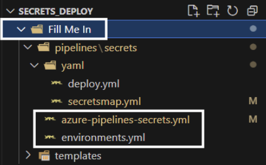
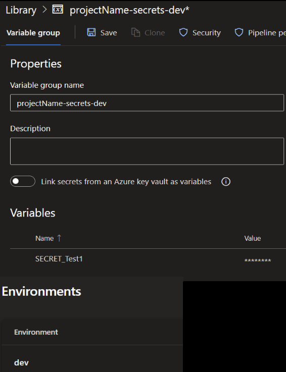

# Setup Introduction 
[HOME](/README.md)
A Guide on how to setup this ADO Library to Azure KeyVault Secret Uploader & Management Pipeline.

| Version | Author | Notes |
|-|-|-|
| 0.1| JamieP0101 | Initial Release |
| 0.2| JamieP0101 | Escape Char Bug Fix |

## What does the pipeline do?
This pipeline deploys variables/secrets that are set in your Azure DevOps Library into a specified Azure Keyvault.
It will also look and compare if the deployment doesn't have any variables/secrets in the Azure DevOps Library that exist in the Azure Keyvault and list them out for you review and then will delete the secret from the Keyvault (Manual Approval required before deleting the secrets it lists).  *Purge Protected Keyvaults can interfer with this step* 

# Assumptions
- We are assuming in this setup you already have configured your own Agent Pool and Service Connections for Azure DevOps.
- You have the knowledge to clone this Repo and get it into your own Azure DevOps.
- You have the right permissions in your ADO Project & Org to setup libraires, environments, pipelines, agent pools & service connections.
- The service connection has been assigned the RBAC role "Key Vault Secrets Officer" on the target key vault.
- You're comfortable using VS Code to edit the repo with branching strategies etc.

## Standard DEV > UAT > PPD > PRD Setup
### VS Code/Repo Config
To set this pipeline up for the standard model this repo ships with, you'll need to update anywhere you find "Fill Me In" or "<Fill Me In>"

- Rename the top level folder to your "Project Name" instead of "Fill Me In"
- Nagivate to the azure-pipelines-secrets.yml file and update line 18 to match the "Project Name" you've just set
- Navigate to the environments.yml file and update the parameters the contain "<Fill Me In>" (agentPool, serviceConnection & keyvaultName) *I recommend just setting up Dev to start with and then commenting in the other environments in this file once you've got a successful run*

### Azure DevOps Config
To configure Azure DevOps and get this pipeline running for the first time you'll need to do the following

- Head to your Azure DevOps Library tab and set up a library to align with what you've just set the "Project Name" to in the repo followed by -secrets-dev as per the image below.
- In this library setup SECRET_Test1 as per the image.
- Head to your Azure DevOps Environments tab and set up "dev" if you haven't already done this previously
- Head to your Azure DevOps Pipelines tab and create a new pipeline from existing template and point it towards the "azure-pipelines-secrets.yml"

### Running the pipeline
- When you run the pipeline you'll have a choice of environments you want to run it against dev/uat/ppd/prd.
- The default is set to dev.
- Once the pipeline succesfully deploys the first test secret you can move over to the README_UserGuide to understand how to start adding new secrets

## Custom Setup breaking away from DEV > UAT > PPD > PRD
If you operate a different naming convention model for you environments you can update the files mentioned above (azure-pipelines-secrets.yml & environments.yml)

