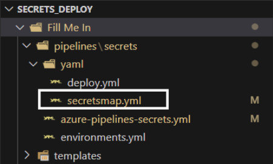

# Introduction 
[HOME](/README.md)
A Guide on how to utulise this Secret Uplaoder.

| Version | Author | Notes |
|-|-|-|
| 0.1| JamieP0101 | Initial Release |

## How to add a new secrets
Firstly head to your ADO Library and set up your new secret, and example is below but the assumption is made you know how to do this and are aware of how to use the "change variable to secret" padlock within the library.  

  
---  

Head to the file called secretsmap.yml in your repo and update to add the new secret you should be able to follow the existing pattern 

example - `Test1=$(SECRET_Test1)`
`<This part is the secret name you'd like in Keyvault>=$(<This is the name of the secret/variable in Azure DevOps Library>)`

